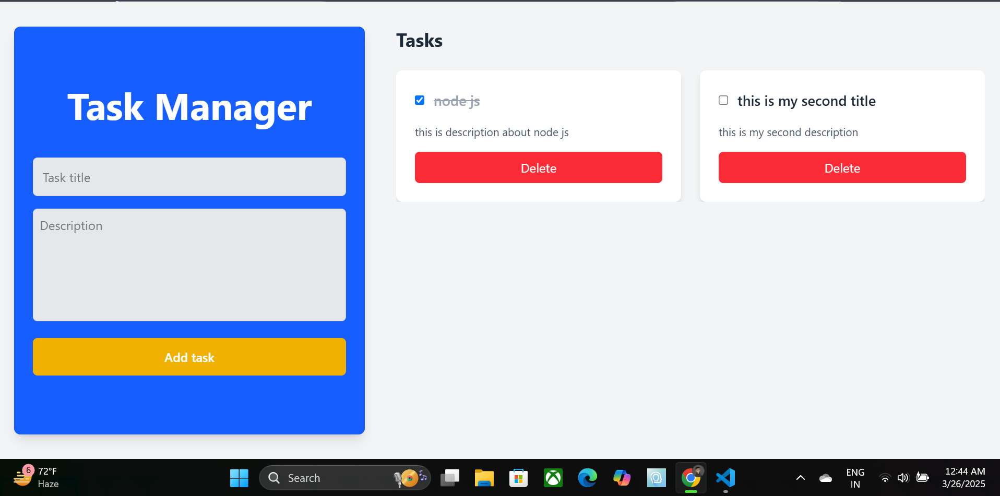

## Task Management App

## Overview

This is a full-stack Task Management web application that enables users to create, update, delete, and mark tasks as completed. The project demonstrates both frontend and backend development skills while following best practices.

## Tech Stack

Frontend: React

Backend: Node.js with Express

Database: MongoDB

## Features

Task Management

Create a task
Edit a task
Delete a task
Mark a task as completed

## Installation and Setup

Clone the repository: https://github.com/Vishesh-21/Algo_Root_Private_Limited_assignment

Install dependencies: npm install

Start the backend server : npm start

Start the frontend : npm run dev

## Screenshots

